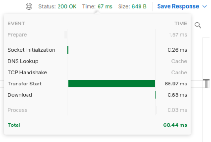
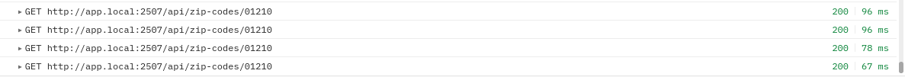
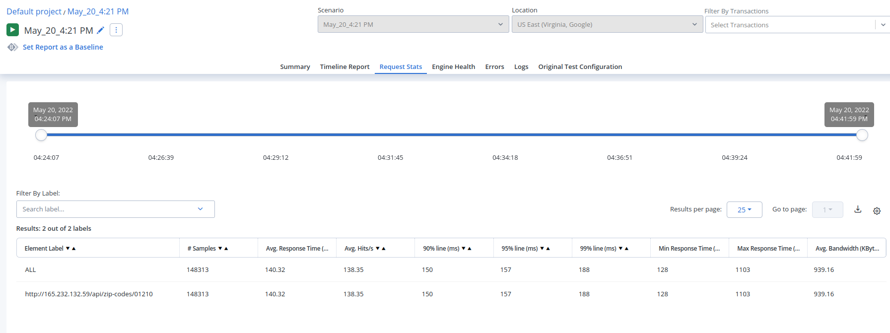
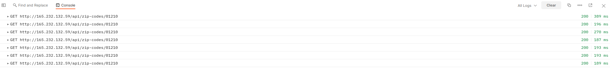
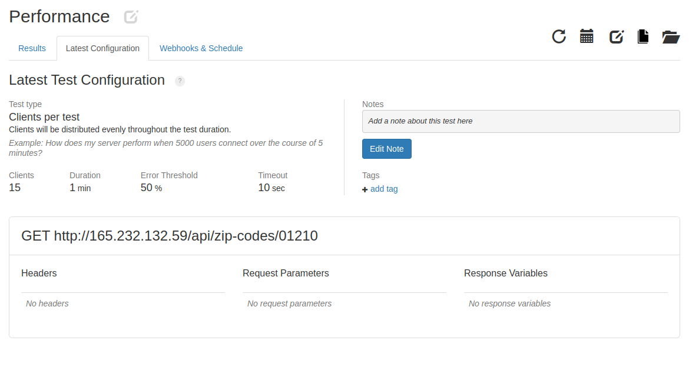
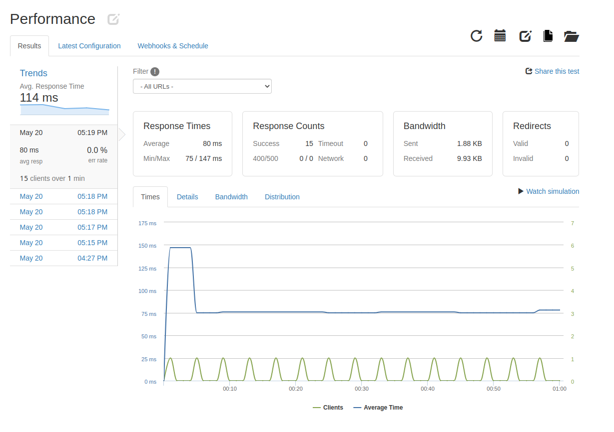

# Backbone Challenge

The objetive of this challenge is to build an API Rest solution, to perform a response
like [this](https://jobs.backbonesystems.io/api/zip-codes/99960)

In order to do this, I made a Laravel 9 Application , and a MongoDB database. 
Also, for improve performance, I used [Laravel Octane](https://laravel.com/docs/9.x/octane) configuration.

The application is hosted on [Digital Ocean](https://www.digitalocean.com/).
The **droplet** characteristics are:

* **Memory**: `512MB`
* **Disk**: `20GB`
* **CPU**: `1 vCPU`
* **IP**: `165.232.132.59`
* **PHP Version**: `8.1`
* **Laravel Version**: `9.0`
* **Database**: `MongoDB`
* **Database Version**: `4.2`
* **Database Size**: `20GB`


### Getting Zip Codes 
For getting the zip code data, I made a simple command to connect to the service and 
launch an event for populate the database. Also It handle the encoding of the data, converting 
to UTF8 `(ISO-8859-1 is the original encoding).`
#### The command for getting the data into:
```bash
~$ php artisan update-zip-codes
```

You can see the code [here](app/Console/Commands/UpdateZipCodes.php)

### Query the data
The application has an endpoint to query the data: `/api/zip-codes/{zip_code}`
It will return the object requested, if it exists:

```json
{
    "zip_code": "01210",
    "federal_entity": {
        "key": 9,
        "name": "Ciudad de México",
        "code": 0
    },
    "locality": "Ciudad de México",
    "municipality": {
        "key": 10,
        "name": "Álvaro Obregón"
    },
    "settlements": [
        {
            "key": 82,
            "name": "Santa Fe",
            "zone_type": "Urbano",
            "settlement_type": {
                "name": "Pueblo"
            }
        }
    ]
}
``` 

## Performance

For this example I made the request:

```bash
~$ curl --location --request GET 'http://app.local:2507/api/zip-codes/01210'
~$ curl --location --request GET 'http://165.232.132.59/api/zip-codes/01210'
```

To measure the local performance I used [Postman](https://www.getpostman.com/):



#### TL;DR: Mongodb Improves cache, so the request is faster than the previous one.



To measure the response time of the Digital Ocean droplet I used [Blazemeter](https://blazemeter.com):



As mentioned, here we can see the improve of the request time with the use of the cache.



Also I use [Loader.io](https://loader.io/) to measure the response time of the application. You can see the results [here](https://bit.ly/3LyrTde)






